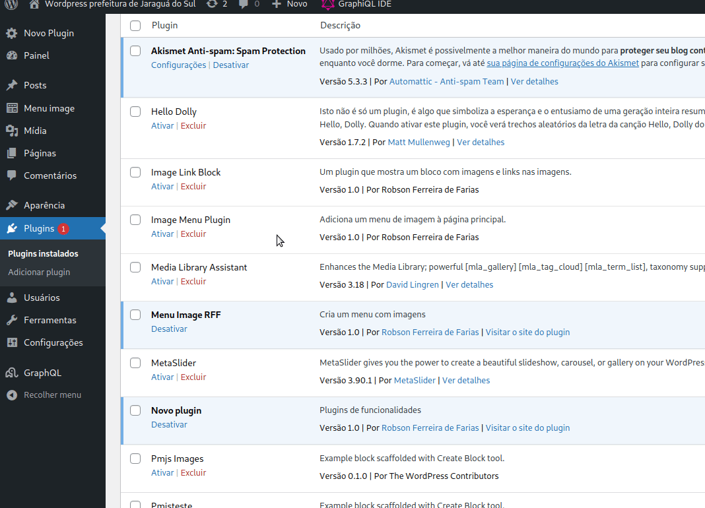
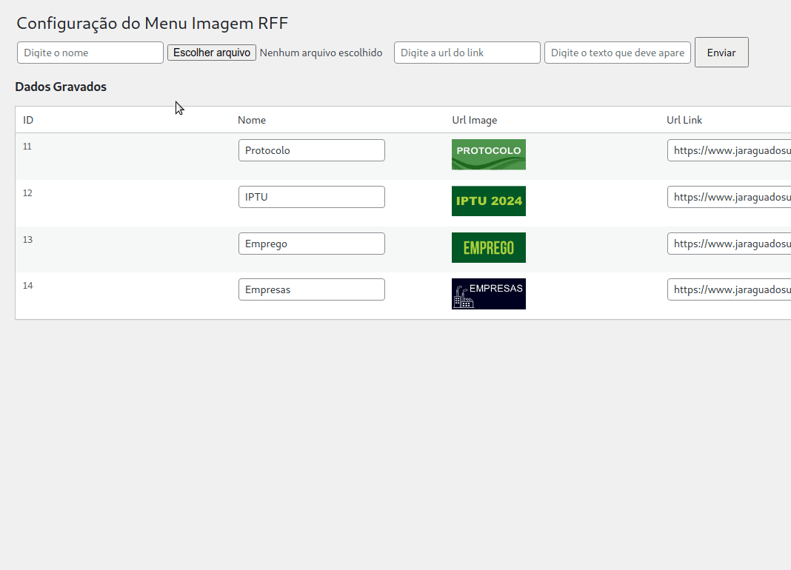
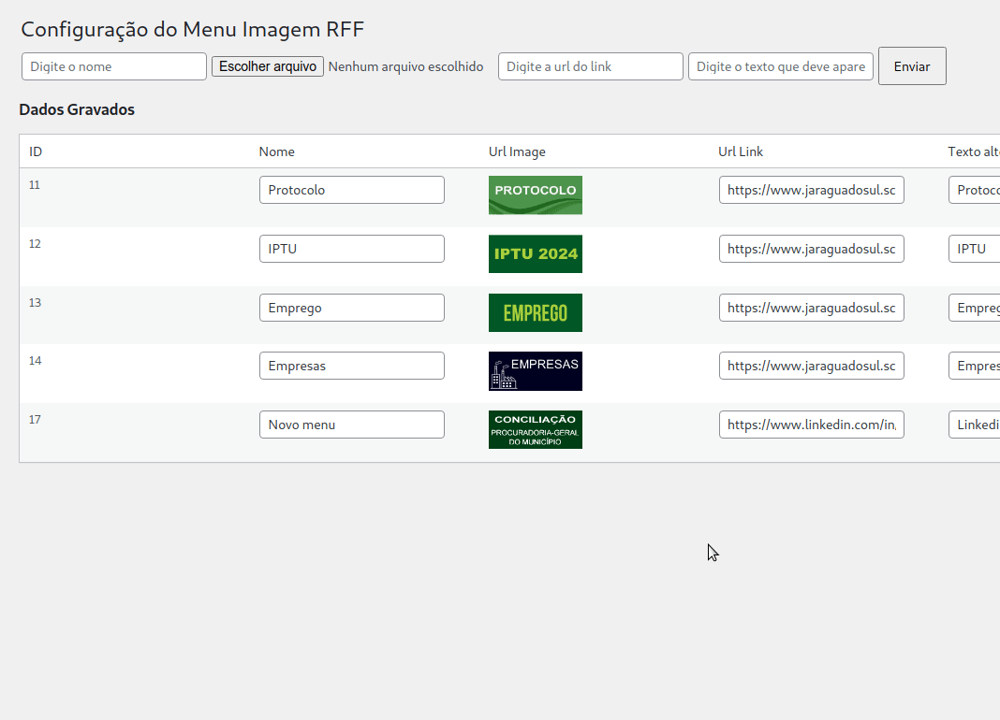
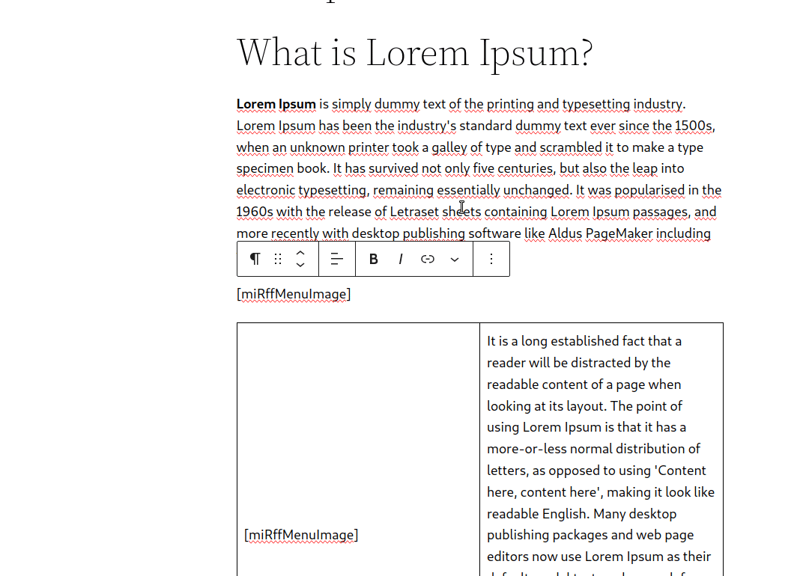
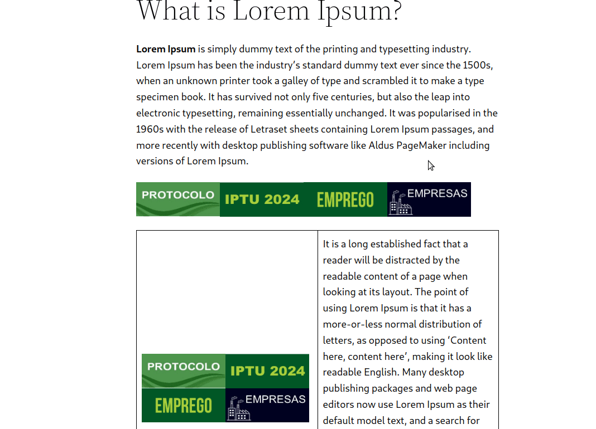
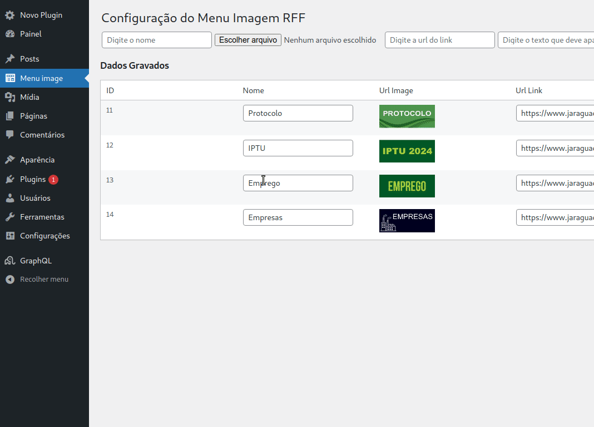

# Plugin-Wordpress-Menu-Image-Rff
 Plugin de menu de imagem para ser inserido em um shortcode, mas administrado na área administrativa no link "Menu image" 

<h2>Ativando o menu</h2>

<h2>Inserindo um item de menu</h2>

<h2>Excluindo um item de menu</h2>

<h2>Inserindo o código no posto usando o [miRffMenuImage]</h2>

<h2>Efeito no post</h2>

<h2>Usando o GraphQl para pegar os registros da tabela</h2>

<h2>Crédito</h2>
Autor: Robson Ferreira de Farias 
Linkedin: <a href="https://www.linkedin.com/in/robson-farias-a8b01723a/" target="_blank">Linkedin do Robson Farias</a>